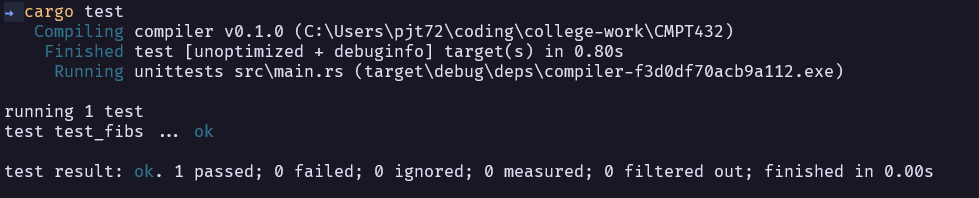
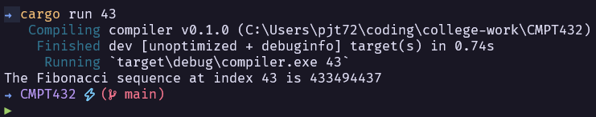

# CMPT 432 - Design of Compilers
Implementing compiler concepts in rust -- a typed and safe language. Rust's compiler is
one of the most picky out of popular langauages. This is mainly because rust solves memory management
in a fairly innovative way. For more information of how rust deals with memory see [here](https://doc.rust-lang.org/book/ch04-01-what-is-ownership.html).

The three main bullets from that execeprt of that link are:
- Each value in Rust has an owner.
- There can only be one owner at a time.
- When the owner goes out of scope, the value will be dropped.

## Building and running a rust program
- Rust comes with a inbuilt CLI tool, cargo, which is used to compile and run rust code.
1. [Install](https://www.rust-lang.org/tools/install) rust for your system
2. `cargo run` in the root directory. This compiles, if needed, and runs the program (See [here](https://doc.rust-lang.org/book/ch01-03-hello-cargo.html#building-and-running-a-cargo-project) for more info)
- Depending on the assignment it may be better practice to use `cargo test` instead
- In the example fibonacci code (may only be in one of the first commits), I show an example running versus testing the code base.
- Using the correct cli tool provides code organization for free as test code is not even compiled in normal runs.
- So for the assignments I will likely provide the example commands

